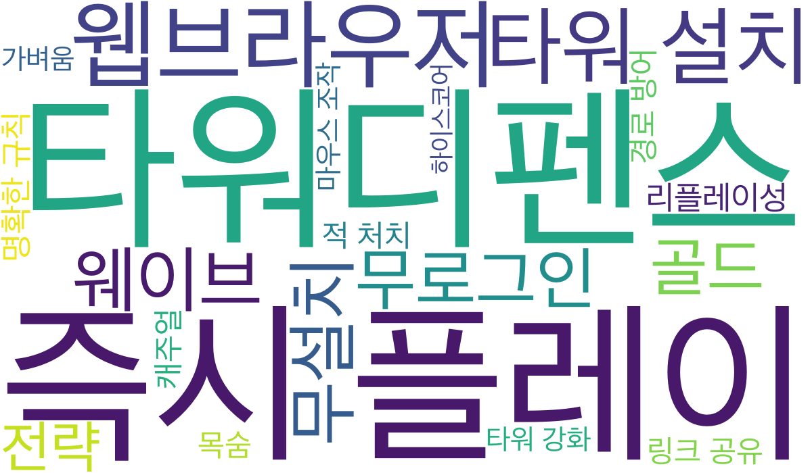

# Step 08. 워드클라우드 만들기

> 목적: 지금까지의 논의를 시각화하여 **나의 생각 → 우리의 생각**으로 맞춘다.

> **Guide:**  
> 1. Agent가 `docs/04`~`07`을 읽고 **키워드·가중치** 표를 채운다.  
> 2. `docs/08_word_cloud.md`의 bash 가이드대로 워드클라우드 이미지를 생성한다.  
> 3. 생성된 이미지를 보며 팀이 중요도를 이야기하고, 가중치를 조정한다. (필요하면 2~3을 반복)

**프롬프트 예시**

```
docs/04~07을 읽고 docs/08_word_cloud.md를 채워줘.
키워드(가중치) 표만 채워줘. 가중치는 1~10 정수로, 중요할수록 크게.
구조와 상단 Guide는 유지하고, 본문 표만 채워줘.
```

## 키워드(가중치)

> `docs/04`~`07`에서 추출한 키워드. 가중치가 클수록 워드클라우드에서 크게 표시된다.

| 키워드 | 가중치 |
|---|---|
| 타워디펜스 | 10 |
| 즉시 플레이 | 10 |
| 웹브라우저 | 9 |
| 타워 설치 | 9 |
| 웨이브 | 8 |
| 골드 | 7 |
| 전략 | 7 |
| 리플레이성 | 7 |
| 무설치 | 8 |
| 무로그인 | 8 |
| 캐주얼 | 6 |
| 목숨 | 6 |
| 적 처치 | 6 |
| 링크 공유 | 6 |
| 명확한 규칙 | 7 |
| 마우스 조작 | 5 |
| 타워 강화 | 5 |
| 하이스코어 | 4 |
| 경로 방어 | 6 |
| 가벼움 | 5 |

## 워드클라우드

```bash
# 의존성 설치
python3 -m venv .venv
source .venv/bin/activate
pip install -r requirements.txt

# 워드클라우드 이미지 생성
source .venv/bin/activate
python scripts/generate_word_cloud.py
```

**Agent 지시 프롬프트**

```
docs/08_word_cloud.md의 bash 가이드를 참고해서 의존성을 설치하고, scripts/generate_word_cloud.py로 docs/assets/word_cloud.png를 생성해줘.
완료되면 생성된 파일 경로와 포함된 키워드 개수를 알려줘.
```


